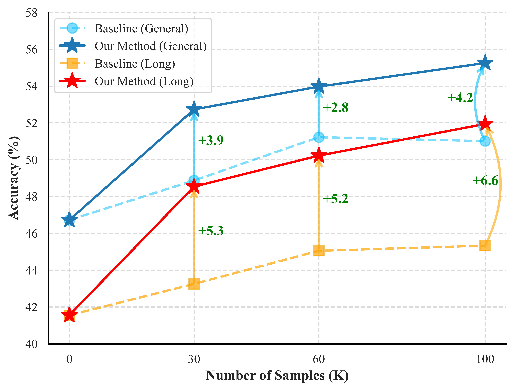
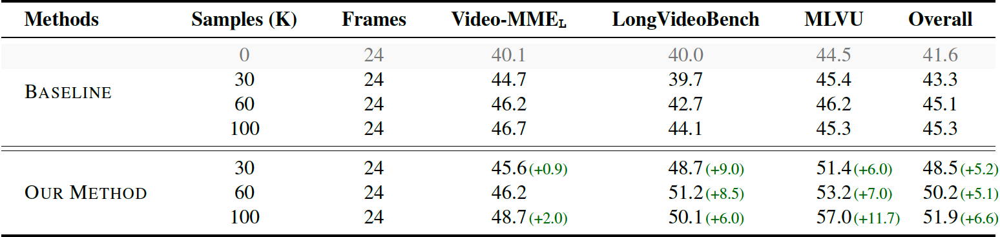

<h1 align="center">
    
<br> Sparrow: Efficient Video Fine-tuning Scheme for MLLMs
</h1>

<p align="center">
       &nbsp&nbsp 📑 <a href="https://arxiv.org/pdf/2411.19951">Paper</a> &nbsp&nbsp  </a> |  &nbsp&nbsp 🤗 <a href="https://huggingface.co/collections/xjtupanda/sparrow-673f104cdaf4ac3340b15964">Hugging Face</a>&nbsp&nbsp 
</p>

**TL;DR:** *We proposed a data augmentation method (synthesizing "video" samples from long QA text data) to enrich the instruction diversity of video data, which facilitates more efficient training with comparable performance.*

## ✨ Highlights

🤔 **Main findings:** The importance of instruction diversity in video fine-tuning and how to efficiently improve it.

- We observed a limited instruction diversity in datasets developed for Video-LLMs, which led to low learning efficiency (<ins>More details and findings are available in our paper</ins>).
- Since text data could be a rich and economical source, we leveraged these data in a format that was more consistent with video instruction data.
  
<p align="center">
    
</p>


***

🚀 **Train less, achieve more:** By mixing in our synthetic data, one can achieve comparable or better performance with much fewer samples.



🚀 **Boost long video understanding "for free":** Improvement in long video understanding without training with any long video data.



## 🛠️ Quick Setup

1. Create a conda virtual environment and install the required packages.

```bash
conda create -n sparrow python=3.9
conda activate sparrow
pip install -r requirements.txt
```

2. Install Flash Attention 2 (for efficient training and inference).
```bash
pip install -U flash-attn --no-build-isolation
```

## 💡 Training & Evaluation
The instructions on training and evaluation (*including pre-trained weights*) are in [TRAIN.md](docs/TRAIN.md) and [EVAL.md](docs/EVAL.md).

## 📖  Misc
For those interested in the implementation details of our paper:
- How to translate text into images? Check [t2vid.py](https://github.com/xjtupanda/T2Vid/blob/main/utils/text-to-images/t2vid.py).
- How to visualize the distribution of instructions? 
  - Calculate embeddings and perform dimensionality reduction for instructions: [calc_inst_embeddings.py](https://github.com/xjtupanda/T2Vid/blob/main/utils/visualization/calc_inst_embeddings.py).
  - Draw plots: [vis-tsne.ipynb](https://github.com/xjtupanda/T2Vid/blob/main/utils/visualization/vis-tsne.ipynb).


## 🙌 Related Projects
* [Video-MME](https://github.com/BradyFU/Video-MME): A comprehensive video benchmark that we mainly use in our study.
* [Awesome-MLLM](https://github.com/BradyFU/Awesome-Multimodal-Large-Language-Models): A project keeping track of new papers and the latest developments in the field of MLLMs.

## 🌻 Acknowledgement
- Great open-sourced MLLMs and code: [MiniCPM-V](https://github.com/OpenBMB/MiniCPM-V), [Idefics3](https://huggingface.co/HuggingFaceM4/Idefics3-8B-Llama3), [InternVL](https://github.com/OpenGVLab/InternVL).
- Long text instruction data: [LongAlpaca](https://huggingface.co/datasets/Yukang/LongAlpaca-12k) and [LongQLoRA](https://huggingface.co/datasets/YeungNLP/LongQLoRA-Dataset).

## 🖋️ Citation

If you find our project useful, please consider citing our paper:
```
@article{yin2024sparrow,
  title={Sparrow: Data-Efficient Video-LLM with Text-to-Image Augmentation},
  author={Yin, Shukang and Fu, Chaoyou and Zhao, Sirui and Shen, Yunhang and Ge, Chunjiang and Yang, Yan and Long, Zuwei and Dai, Yuhan and Luo, Yongdong and Cao, Haoyu and others},
  journal={arXiv preprint arXiv:2411.19951},
  year={2024}
}
```


